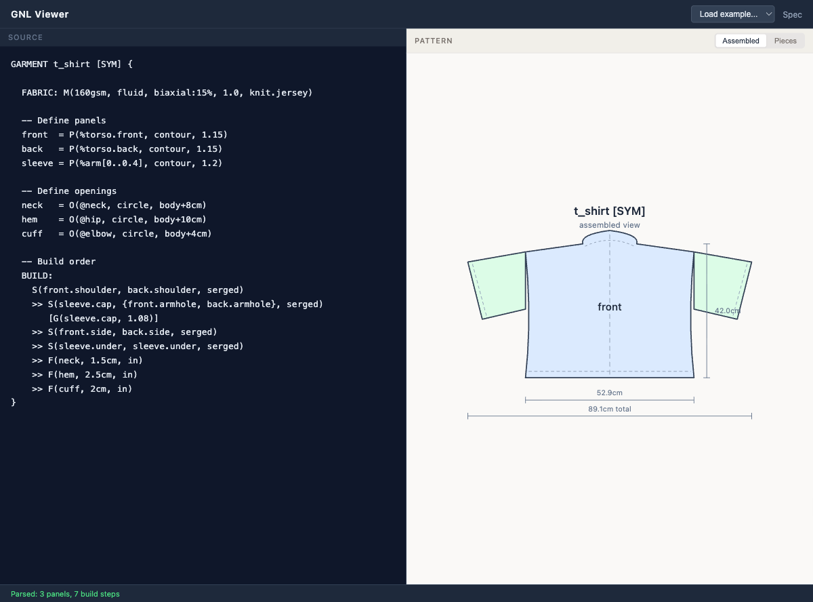
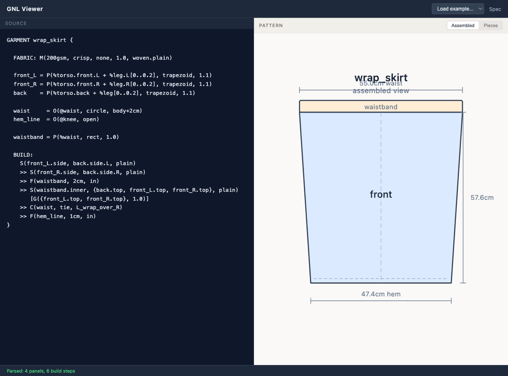
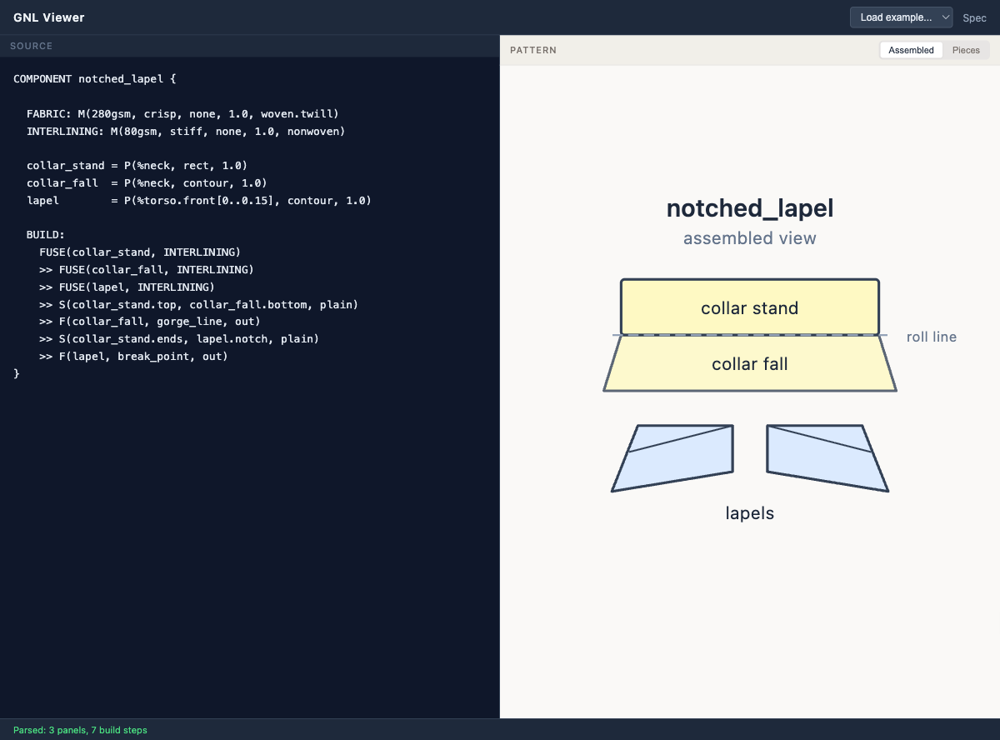
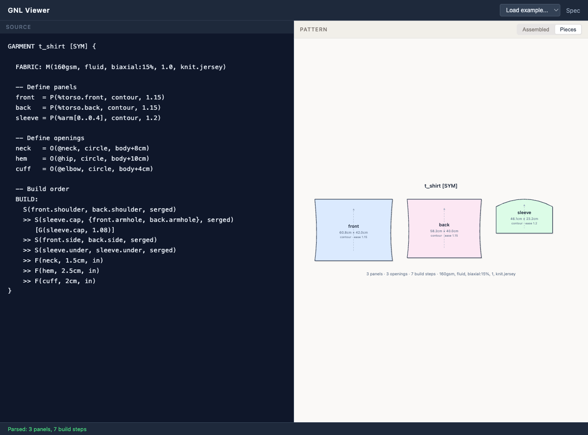

# GNL — Garment Notation Language

A formal descriptive language for clothing construction.

**[Try the live viewer](https://khalildh.github.io/garment-notation/viewer/)**

Dance has Labanotation. Music has staff notation. Architecture has plan/section/elevation conventions. GNL brings the same rigor to garments — a generative descriptive language where a valid expression is sufficient to construct a garment without ambiguity.



## Core Concepts

- **Body-anchored** — the body is the coordinate system, using anatomical landmarks (`@shoulder.L`) and regions (`%torso.front`)
- **Topological** — garments are surfaces with boundaries and openings
- **Constructive** — descriptions encode build order, not just final form
- **Composable** — complex garments are compositions of simpler elements

## Quick Example

```
GARMENT t_shirt [SYM] {
  FABRIC: M(160gsm, fluid, biaxial:15%, 1.0, knit.jersey)

  front  = P(%torso.front, contour, 1.15)
  back   = P(%torso.back, contour, 1.15)
  sleeve = P(%arm[0..0.4], contour, 1.2)

  neck = O(@neck, circle, body+8cm)
  hem  = O(@hip, circle, body+10cm)

  BUILD:
    S(front.shoulder, back.shoulder, serged)
    >> S(sleeve.cap, {front.armhole, back.armhole}, serged)
    >> S(front.side, back.side, serged)
    >> F(hem, 2.5cm, in)
}
```

## Grammar

The language is formally defined as a [PEG grammar](grammar/gnl.peg) targeting [Peggy](https://peggyjs.org). The generated parser produces a richly-typed AST which is adapted to the renderer's internal format at runtime.

```sh
npm install          # install Peggy (dev dependency only)
npm run generate     # regenerate viewer/src/gnl-parser.js from grammar/gnl.peg
npm test             # run parse + adapter tests against all examples
```

## Viewer

The repo includes a [live viewer](https://khalildh.github.io/garment-notation/viewer/) that parses GNL and renders both assembled garment views and flat pattern pieces.

### Assembled View

Write GNL on the left, see the full garment on the right — with stitch lines, dimension callouts, and construction details.

| T-Shirt | Wrap Skirt | Jacket Collar |
|---------|------------|---------------|
|  |  |  |

### Pattern Pieces

Toggle to "Pieces" to see the individual flat pattern pieces with shape outlines, grain lines, and dimensions.



## Dataset Converters

The repo includes [converters](converter/) that transform real sewing patterns into GNL:

- the [Korosteleva NeurIPS 2021 dataset](https://github.com/maria-korosteleva/Garment-Pattern-Generator) — 21 parametric templates
- [GarmentCodeData (ECCV 2024)](https://github.com/maria-korosteleva/GarmentCode) — modular panel naming, edge labels, darts

```sh
node converter/convert.js       # auto-downloads 21 Korosteleva templates, converts all
node converter/convert-gcd.js   # converts the bundled GarmentCodeData examples
node converter/evaluate.js      # measures what the conversion actually carries
```

Examples from both datasets are available directly in the viewer — select from the "Korosteleva Dataset" or "GarmentCodeData" sections of the examples dropdown. A GNL/JSON toggle lets you compare the raw geometric input with the converted output.

### What the conversion is worth

Converted GNL parses and renders exactly like hand-written GNL, which makes it easy to assume it is just as good. `converter/evaluate.js` asks two separate questions and reports both:

| | across 30 dataset templates |
|---|---|
| **Round trip** — can the GNL document alone be turned back into the pattern? | 1060/1060 edges, 398/398 stitches, 0 spurious |
| **Semantics** — do the inferred edge names explain the stitching? | 98% of edges named, 89% of seams join edges that agree about what they are |

The round trip is asserted by `npm test`; the semantic score is reported, not enforced, because naming every edge `edge0..edgeN` would pass the first test and fail the point of the second. The remaining 11% is concentrated in hoods and multi-panel bodices, where GNL has no vocabulary for the feature being stitched.

See [converter/README.md](converter/README.md) for details on the mapping approach.

## Documentation

- **[Full Specification](garment-notation.md)** — the complete v0.3 spec

## Star History

<picture>
  <source media="(prefers-color-scheme: dark)" srcset="https://api.star-history.com/svg?repos=khalildh/garment-notation&type=Date&theme=dark" />
  <source media="(prefers-color-scheme: light)" srcset="https://api.star-history.com/svg?repos=khalildh/garment-notation&type=Date" />
  
</picture>

## Status

**v0.3 — Draft.** Adds literal panel outlines (`poly`) and measured opening circumferences, which is what lets a real pattern survive the trip into GNL and back out. v0.2 added the grain parameter, directional ease, princess seams (`EDGE`), lining (`LAYER`), and component composition (`USE`/`ATTACH`).

A `poly` document carries its own geometry and is sufficient to build from. A `contour` document is not, yet — it is sufficient only relative to a body model and a drafting procedure that the spec does not currently define normatively. Closing that is the next real piece of work; see §4.5 of the spec.

A starting point that will need refinement through use, critique, and input from garment-makers, pattern-drafters, and computational designers.

## License

All rights reserved.
